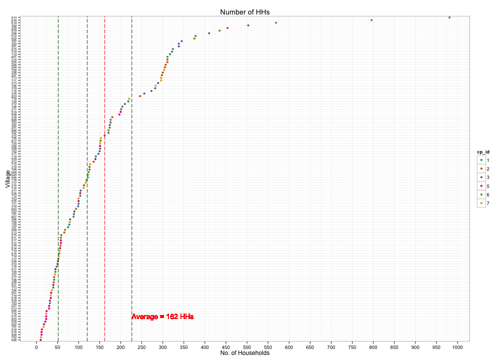

## Read-And-Delete

---
title       : 
subtitle    : 
author      : 
job         : 
framework   : io2012        # {io2012, html5slides, shower, dzslides, ...}
highlighter : highlight.js  # {highlight.js, prettify, highlight}
hitheme     : tomorrow      # 
widgets     : []            # {mathjax, quiz, bootstrap}
mode        : selfcontained # {standalone, draft}
knit        : slidify::knit2slides
---

## Read-And-Delete

 

--- .class #id 

## Slide 2
--- .class #id 

## Slide 2

